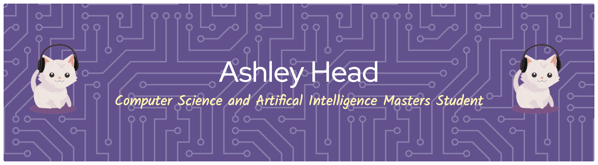

  

# Hi there, I'm Ashley! 👋

# 💫 About Me:
I am currently studying Computer Science with Artifical Intelligence at the University of Gloucestershire.  I am learning Python code and SQL on Mimo and undertaking an Azure course with Microsoft. 

# 💻 Tech Stack:
        

## 🏆 Microsoft Learn Achievements

  
  

> [!TIP]
> Click a badge to view my full transcript on Microsoft Learn.

### 🔭 Current Focus
- 🤖 Deepening my knowledge in **Machine Learning Model Training**.
- ☁️ Exploring advanced **Azure AI services**.
- 💻 Building projects in **Python and SQL**.

### ✍️ Random Dev Quote

# 📊 GitHub Stats:
 
 

## 🌐 Socials:
 
 
 

>
> 

<!-- Proudly created with GPRM ( https://gprm.itsvg.in ) -->
